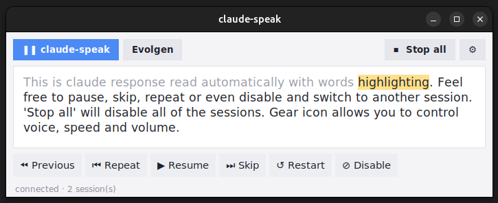

# claude-speak

Reads Claude Code's replies aloud, and gives you control over **when** and **what** it speaks.

A background daemon watches every Claude Code conversation log under `~/.claude/projects/`, and reads responses automatically using edge-tts.
Simple UI gives you full control over which session talks and when + voice control settings.

Linux only. Forked from [silverdolphin863/claude-speak](https://github.com/silverdolphin863/claude-speak).



## Install

Requires Python 3.10+, and `mpv` for playback. `espeak-ng` is used automatically if the network is down, and `xsel` is only needed for the read-the-clipboard shortcut below.

```bash
sudo apt install mpv espeak-ng xsel

git clone https://github.com/<you>/claude-speak.git
cd claude-speak
python3 -m venv .venv
.venv/bin/pip install -r requirements.txt
```

Check it works — this should start talking within a couple of seconds:

```bash
.venv/bin/python speak_daemon.py & # leave running
.venv/bin/python speak_ui.py       # opens UI
```

Now every Claude Code response should be read automatically and a new tab should appear per each open session.

## Start it automatically

To make the daemon run on startup copy the two files in `setup/` and enable the service:

```bash
cp setup/claude-speak.service ~/.config/systemd/user/
systemctl --user daemon-reload
systemctl --user enable --now claude-speak
```

Edit the `ExecStart` path in `setup/claude-speak.service` to actual repo path where you've cloned this repository.

To get the UI in your app grid, copy the desktop entry to applications folder:

```bash
cp setup/claude-speak.desktop ~/.local/share/applications/
```

Then launch **Claude Speak** like any other app. The window and the daemon are independent — closing the window leaves speech running, and reopening it reconnects.

Useful service commands:

```bash
systemctl --user status claude-speak  # see status
systemctl --user restart claude-speak # needed after editing speak_daemon.py
journalctl --user -u claude-speak -f  # follow the log
```

## Using it

Each active Claude Code session gets a tab. The transport buttons act on the selected tab:

| Button | Effect |
|---|---|
| Pause / Resume | Hold this session; the speaker stays reserved for it |
| Skip | Jump to the next paragraph |
| Previous / Repeat | Re-read the previous or current paragraph |
| Restart | Re-read the message from the top |
| Disable | Silence this session until you enable it again |
| Stop all | Silence everything until undone |

Pressing Play on a different tab moves the speaker to it and pauses the first one where it stood, so nothing is lost by switching.

## Settings

The ⚙ button opens voice, speed and volume. Changes take effect as you make them and are saved to `~/.claude/claude-speak.json`.
Whatever is set here is used for every session.

## Keyboard shortcuts

`speak_ctl.py` sends one command to the daemon and exits, which makes it easy to bind to a key:

```bash
.venv/bin/python speak_ctl.py toggle      # pause / resume
.venv/bin/python speak_ctl.py skip        # next paragraph
.venv/bin/python speak_ctl.py repeat      # re-read current paragraph
.venv/bin/python speak_ctl.py stop_all    # silence everything until undone
.venv/bin/python speak_ctl.py unmute_all  # undo it
```

`speak_engine.py` reads piped text aloud in its own tab, which is handy for reading the clipboard:

```bash
echo "$(xsel -o)" | .venv/bin/python speak_engine.py
```

On GNOME, bind either of those under **Settings → Keyboard → View and Customize Shortcuts → Custom Shortcuts → +**. Give it a name, paste the command as

```
bash -c 'echo "$(xsel -o)" | ~/code/AI/audio/claude-speak/.venv/bin/python ~/code/AI/audio/claude-speak/speak_engine.py'
```

and set the key. A custom shortcut runs without a shell, so the `bash -c` wrapper and full paths are both required.
